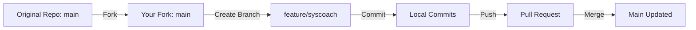

# 🛡️ SysCoach: AI-Powered Windows System Assistant

A cross-functional project that combines PowerShell, R, and RShiny to scan, analyze, and **intelligently respond to** real-time Windows system performance and security data — built for developers, analysts, and non-technical users alike.

---

## 📌 Table of Contents

* [📖 Summary](#📖-summary)
* [🚀 Features](#🚀-features)
* [📦 Tech Stack](#📦-tech-stack)
* [📚 Installed Packages](#📚-installed-packages)
* [🧠 Why This Matters](#🧠-why-this-matters)
* [🔧 PowerShell Audit Script](#🔧-powershell-audit-script)
* [🧪 RShiny Dashboard Code](#🧪-rshiny-dashboard-code)
* [📁 File Structure](#📁-file-structure)
* [📝 UTF-8 Compatibility Fix](#📝-utf-8-compatibility-fix)
* [✅ Conclusion](#✅-conclusion)
* [🧭 Forking Workflow Diagram](#🧭-forking-workflow-diagram)

---

## 📖 Summary

**SysCoach** is a secure, AI-guided Windows system auditor that:

* Runs a **PowerShell health check**
* Exports results as structured **JSON**
* Loads data into an **interactive RShiny dashboard**
* Uses **natural language input** to explain results or answer questions

Built for:

* 🧑‍💻 **New developers** learning PowerShell and R
* 🧠 **Data scientists** curious about system behavior
* 👩‍💼 **Non-technical users** wanting real-time insights without Terminal

---

## 🚀 Features

✔️ PowerShell-based system health scan
✔️ Clean JSON format for R parsing
✔️ Smart file detection (auto-loads latest report)
✔️ Responsive RShiny interface with tabs
✔️ AI-style query handler ("What’s using CPU?")
✔️ Graceful handling of missing data or invalid files
✔️ Dark-mode with Bootstrap 5 themes

---

## 📦 Tech Stack


---

## 📚 Installed Packages


---

## 🧠 Why This Matters

Most system monitoring tools are either overly complex or completely locked behind GUI menus.

SysCoach helps users:

* Understand their machines through readable data
* Answer natural language queries like "Which services are not running?"
* Explore how scripting + data science can enhance DevOps

This is more than a dashboard — it’s a **smart command center**.

---

## 🔧 PowerShell Audit Script

*See: `powershell/sentinel-audit.ps1`*

```powershell
$homeFolder = [Environment]::GetFolderPath("MyDocuments")
$projectRoot = Join-Path $homeFolder "SysCoach"
$outputPath = Join-Path $projectRoot "output"

if (!(Test-Path $outputPath)) {
    New-Item -Path $outputPath -ItemType Directory -Force | Out-Null
}

$report = @{}
$report["HighCPUProcesses"] = Get-Process |
    Where-Object { $_.CPU -gt 100 } |
    Select-Object Name, Id, CPU

$report["Services"] = Get-Service |
    Select-Object Name, Status, StartType

try {
    $defender = Get-MpComputerStatus
    $report["Defender"] = $defender | Select-Object AMServiceEnabled, RealTimeProtectionEnabled, AntispywareEnabled
} catch {
    $report["Defender"] = @{ Error = "Defender data not available on this system." }
}

$timestamp = Get-Date -Format "yyyyMMdd_HHmmss"
$filename = "sys_report_$timestamp.json"
$outputFile = Join-Path $outputPath $filename

$json = $report | ConvertTo-Json -Depth 5
[System.IO.File]::WriteAllText($outputFile, $json, [System.Text.Encoding]::UTF8)

Write-Output "✅ Audit complete. File saved to:"
Write-Output $outputFile
```

---

## 🧪 RShiny Dashboard Code

*See: `R/app.R`*

* Auto-detects valid reports (via hardcoded path or fallback)
* Shows: CPU, Services, Defender
* Natural language input triggers AI-style logic
* Responds gracefully to missing/invalid input

---

## 📁 File Structure

```
syscoach/
├── powershell/
│   └── sentinel-audit.ps1
├── R/
│   └── app.R
├── output/
│   └── sys_report_<timestamp>.json
├── README.md
```

---

## 📝 UTF-8 Compatibility Fix

PowerShell defaults to UTF-16, which causes JSON parsing errors in R.
We override it:

```powershell
[System.IO.File]::WriteAllText($outputFile, $json, [System.Text.Encoding]::UTF8)
```

This ensures `jsonlite::fromJSON()` works every time.

---

## ✅ Conclusion

**SysCoach** merges system diagnostics, scripting, visualization, and human-readable feedback — all without requiring you to memorize terminal commands.

It’s an evolving platform for AI-assisted observability. Fork it. Run it. Expand it.

---

## 🧭 Forking Workflow Diagram


